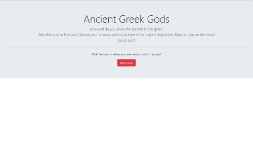

# Greek Gods Quiz

A simple 4 question quiz game about the ancient Greek gods.
User answers 4 multiple choise questions and receives a score according to how well he answered.
5 seconds are deducted every time the user gives a wrong answer.
A highscore list is displayed at the end of each game.
This projects is part of my UPenn LPS Coding Bootcamp studies (homework 4).

### Installing

- Run 1quizmain.html on your favorite browser.
- Be sure to keep all files in the same directory.

Here is a sample of the 3 screens this portfolio consists of:

**You can also access the portfolio by clicking [here](https://dmjohnspor.github.io/greek_gods_quiz/).**

## Built With

* [Visual Studio Code](https://code.visualstudio.com/) - For standard coding
* [Bootstrap](https://getbootstrap.com/) - Front-end component library
* [Pixlr](https://pixlr.com/) - Used to edit the images and screenshots used

## Contributing

Please read [CONTRIBUTING.md](https://gist.github.com/PurpleBooth/b24679402957c63ec426) for details on our code of conduct, and the process for submitting pull requests to us.

## Versioning

We use [SemVer](http://semver.org/) for versioning. For the versions available, see the [tags on this repository](https://github.com/dmjohnspor/Sporidis-Foster_Portfolio/commits/master). 

## Authors

* **Ioannis Sporidis-Foster** - *Initial work* - [dmjohnspor](https://github.com/dmjohnspor)
* **Anthony Briglia** - *Instruction, guidance and corrections*
* **Artan Muzhaqi** - *Guidance and corrections*
* **Tom Woods** - *Guidance and corrections*

## Acknowledgments

* Hat tip to anyone whose code was used.
* A big thank you to Anthony, Tani and Tom for all their support and guidance.
* To all my fellow classmates in the bootcamp. Thank you for your continuing help and support!
* Stay healthy and safe!

